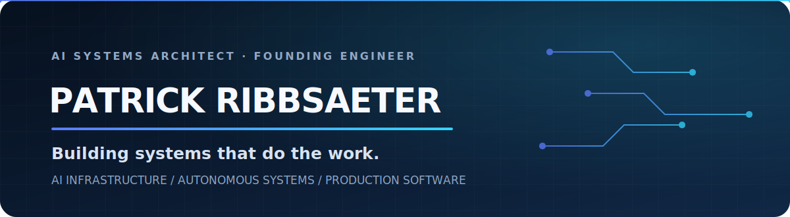

<p align="center">
  
</p>

<p align="center">
  <a href="https://www.linkedin.com/in/patrick-ribbsaeter"></a>
  <a href="https://patrickribbsaeter.com"></a>
  
</p>

I build **enterprise AI systems, automation engines, and production software** from the interface to the infrastructure. My focus is high-leverage engineering: turning expensive operational problems into secure, reliable systems that can be measured, maintained, and scaled.

## High-value engineering focus

| Capability | What I build |
|---|---|
| **Enterprise AI systems** | Agent platforms, retrieval systems, evaluations, guardrails, model routing, and human-in-the-loop control |
| **Forward-deployed engineering** | Production solutions shaped around real users, workflows, constraints, and business outcomes |
| **AI infrastructure & MLOps** | Model serving, observability, data pipelines, deployment systems, reliability, and cost control |
| **Platform engineering** | Internal developer platforms, APIs, cloud architecture, CI/CD, infrastructure as code, and secure operations |
| **Intelligent automation** | Multi-step workflow engines, tool orchestration, document pipelines, integrations, and exception handling |
| **Full-stack AI products** | High-quality product interfaces backed by dependable AI, data, and distributed-system foundations |

## Polyglot engineering

The stack follows the problem. **AI expands delivery breadth; builds, tests, reviews, and target-system conventions establish correctness.**

<p align="center">
  
</p>
<p align="center">
  
</p>

**Language domains:** Python · TypeScript · JavaScript · Go · Rust · C · C++ · C# · Java · Kotlin · Swift · PHP · Ruby · Scala · Elixir · Clojure · Haskell · Dart · Lua · Perl · R · MATLAB · Solidity · SQL · Bash · PowerShell

### Frameworks, AI, data, and infrastructure

<p align="center">
  
</p>

| Area | Technology territory |
|---|---|
| **AI & data** | PyTorch, TensorFlow, Hugging Face, LLM APIs, RAG, evaluation systems, pandas, Spark, PostgreSQL, Redis, vector search |
| **Applications & APIs** | React, Next.js, Node.js, FastAPI, Django, Flask, NestJS, Spring Boot, .NET, REST, GraphQL, event-driven services |
| **Cloud & platform** | Linux, Docker, Kubernetes, AWS, Azure, GCP, Terraform, Ansible, GitHub Actions, observability, security controls |
| **Architecture** | Distributed systems, asynchronous workflows, multi-agent orchestration, integration architecture, reliability engineering |

## How I work

```text
Business outcome → narrow production slice → instrument and verify → scale from evidence
```

- **Outcome-first:** technology is selected for business impact, not novelty.
- **Production-minded:** security, failure modes, observability, and operating cost are part of the design.
- **Full-stack ownership:** product, model, data, backend, infrastructure, and delivery are one system.
- **Evidence over claims:** working software, tests, benchmarks, reviews, and releases establish credibility.

## Current direction

Building original, production-grade AI and automation projects while contributing focused improvements to established open-source systems.

<p align="center"><strong>Design the system. Ship the smallest complete version. Verify it. Improve from evidence.</strong></p>

<!-- GitHub profile README -->
