<div align="center">

<a href="https://www.ribbsaeter.com/">
  
</a>

<br /><br />

<a href="https://www.ribbsaeter.com/">
  
</a>
&nbsp;&nbsp;
<a href="https://www.linkedin.com/in/patrickribbsaeter/">
  
</a>

<br />

`SWITZERLAND` &nbsp;·&nbsp; `AI SYSTEMS ARCHITECT` &nbsp;·&nbsp; `FOUNDING ENGINEER`

### I design the system, ship the product, and verify the outcome.

Enterprise AI infrastructure, autonomous agents, workflow automation, SaaS platforms,<br />
and production software—from interface to infrastructure.

</div>

<br />

## 01 — What I build

<table>
<tr>
<td width="50%" valign="top">

### ◈ Intelligent systems

Production AI systems that can reason, retrieve, call tools, retain context, coordinate work, and escalate safely.

`AI AGENTS` `RAG` `MODEL ROUTING` `MEMORY` `EVALUATION` `GUARDRAILS`

</td>
<td width="50%" valign="top">

### ◇ Digital products

Complete SaaS products and internal platforms with refined interfaces, secure APIs, billing, analytics, and operational workflows.

`SAAS` `CLIENT PORTALS` `DASHBOARDS` `APIs` `BILLING` `AUTOMATION`

</td>
</tr>
<tr>
<td width="50%" valign="top">

### ⬡ AI infrastructure

Reliable model-serving and data foundations designed around observability, security, cost control, and scale.

`MLOPS` `CLOUD` `KUBERNETES` `DATA PIPELINES` `OBSERVABILITY` `IaC`

</td>
<td width="50%" valign="top">

### ✦ Generative production

Automated systems for image, video, synthetic media, identity continuity, and high-volume creative delivery.

`MULTIMODAL AI` `VIDEO PIPELINES` `GENERATIVE MEDIA` `DESIGN SYSTEMS`

</td>
</tr>
</table>

<br />

## 02 — AI model ecosystem

<div align="center">

<a href="https://openai.com"></a>
<a href="https://www.anthropic.com"></a>
<a href="https://gemini.google.com"></a>
<a href="https://www.llama.com"></a>
<a href="https://huggingface.co"></a>

<a href="https://mistral.ai"></a>
<a href="https://www.deepseek.com"></a>
<a href="https://www.moonshot.ai"></a>
<a href="https://qwen.ai"></a>
<a href="https://x.ai"></a>

<a href="https://cohere.com"></a>
<a href="https://www.01.ai"></a>
<a href="https://z.ai"></a>
<a href="https://www.ai21.com"></a>
<a href="https://www.minimax.io"></a>

<a href="https://ai.azure.com"></a>
<a href="https://aws.amazon.com/bedrock/"></a>
<a href="https://www.nvidia.com/en-us/ai/"></a>
<a href="https://groq.com"></a>
<a href="https://www.cerebras.ai"></a>

</div>

<br />

## 03 — Engineering stack

<div align="center">

### Languages

<a href="https://www.python.org/" title="Python">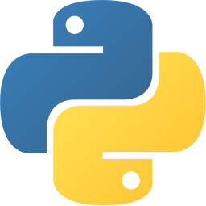</a>&nbsp;
<a href="https://www.typescriptlang.org/" title="TypeScript"></a>&nbsp;
<a href="https://developer.mozilla.org/en-US/docs/Web/JavaScript" title="JavaScript">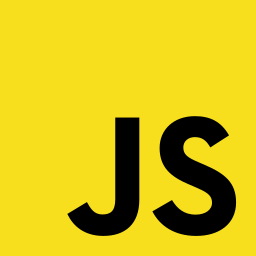</a>&nbsp;
<a href="https://nodejs.org/" title="Node.js">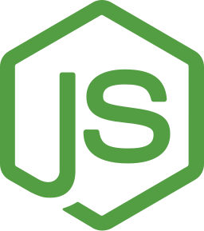</a>&nbsp;
<a href="https://go.dev/" title="Go">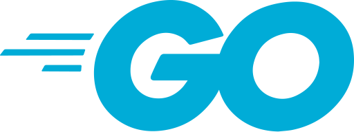</a>&nbsp;
<a href="https://www.rust-lang.org/" title="Rust"><picture><source media="(prefers-color-scheme: dark)" srcset="./assets/stack/rust-dark.svg"></picture></a>&nbsp;
<a href="https://www.open-std.org/jtc1/sc22/wg14/" title="C">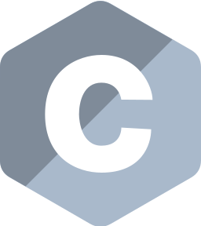</a>&nbsp;
<a href="https://isocpp.org/" title="C++">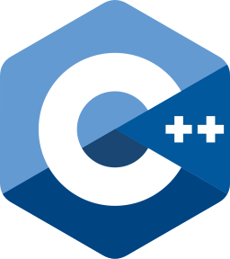</a>&nbsp;
<a href="https://dotnet.microsoft.com/languages/csharp" title="C#">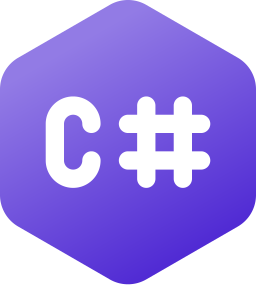</a>&nbsp;
<a href="https://www.java.com/" title="Java"></a>&nbsp;
<a href="https://kotlinlang.org/" title="Kotlin">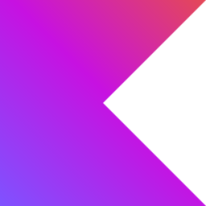</a>&nbsp;
<a href="https://www.swift.org/" title="Swift">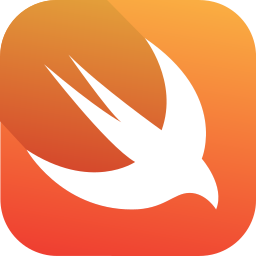</a>

### Applications & APIs

<a href="https://react.dev/" title="React"></a>&nbsp;
<a href="https://nextjs.org/" title="Next.js"><picture><source media="(prefers-color-scheme: dark)" srcset="./assets/stack/nextjs-dark.svg">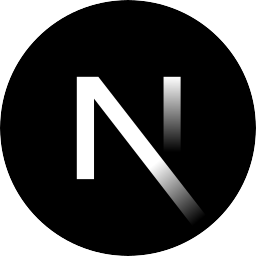</picture></a>&nbsp;
<a href="https://nodejs.org/" title="Node.js"></a>&nbsp;
<a href="https://www.djangoproject.com/" title="Django"></a>&nbsp;
<a href="https://flask.palletsprojects.com/" title="Flask"><picture><source media="(prefers-color-scheme: dark)" srcset="./assets/stack/flask-dark.svg"></picture></a>&nbsp;
<a href="https://fastapi.tiangolo.com/" title="FastAPI">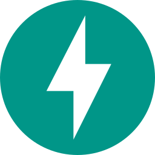</a>&nbsp;
<a href="https://spring.io/" title="Spring">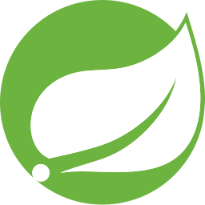</a>&nbsp;
<a href="https://dotnet.microsoft.com/" title=".NET"></a>&nbsp;
<a href="https://graphql.org/" title="GraphQL">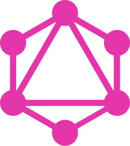</a>

### Automation & orchestration

<a href="https://n8n.io/" title="n8n"></a>&nbsp;
<a href="https://zapier.com/" title="Zapier"></a>&nbsp;
<a href="https://www.make.com/" title="Make"></a>

### Cloud & platform

<a href="https://www.linuxfoundation.org/" title="Linux"></a>&nbsp;
<a href="https://www.docker.com/" title="Docker">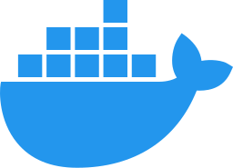</a>&nbsp;
<a href="https://kubernetes.io/" title="Kubernetes">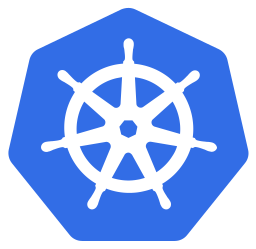</a>&nbsp;
<a href="https://git-scm.com/" title="Git">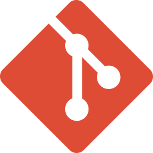</a>&nbsp;
<a href="https://github.com/" title="GitHub"><picture><source media="(prefers-color-scheme: dark)" srcset="./assets/stack/github.svg"></picture></a>&nbsp;
<a href="https://github.com/features/actions" title="GitHub Actions">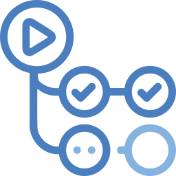</a>&nbsp;
<a href="https://aws.amazon.com/" title="Amazon Web Services"><picture><source media="(prefers-color-scheme: dark)" srcset="./assets/stack/aws-dark.svg"></picture></a>&nbsp;
<a href="https://azure.microsoft.com/" title="Microsoft Azure"></a>&nbsp;
<a href="https://cloud.google.com/" title="Google Cloud">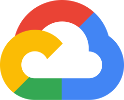</a>&nbsp;
<a href="https://developer.hashicorp.com/terraform" title="Terraform">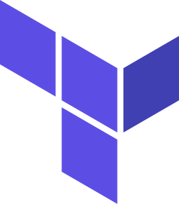</a>&nbsp;
<a href="https://www.ansible.com/" title="Ansible"><picture><source media="(prefers-color-scheme: dark)" srcset="./assets/stack/ansible-dark.svg">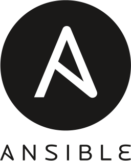</picture></a>&nbsp;
<a href="https://www.cloudflare.com/" title="Cloudflare"></a>

### Data & intelligence

<a href="https://www.postgresql.org/" title="PostgreSQL">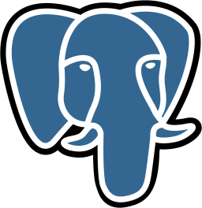</a>&nbsp;
<a href="https://redis.io/" title="Redis">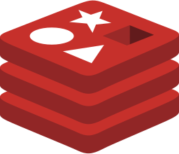</a>&nbsp;
<a href="https://www.mongodb.com/" title="MongoDB">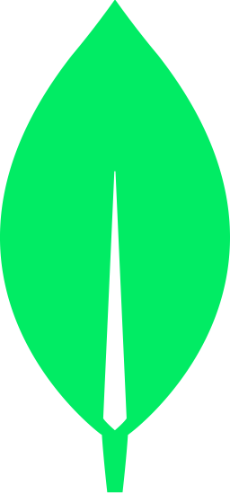</a>&nbsp;
<a href="https://www.elastic.co/elasticsearch" title="Elasticsearch"></a>&nbsp;
<a href="https://pytorch.org/" title="PyTorch">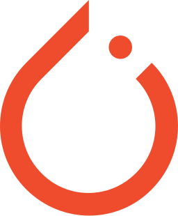</a>&nbsp;
<a href="https://www.tensorflow.org/" title="TensorFlow">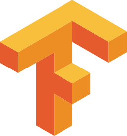</a>

</div>

<br />

<div align="center">

### Design, motion & visual suite

<a href="https://www.adobe.com/products/photoshop.html" title="Adobe Photoshop"></a>&nbsp;
<a href="https://www.adobe.com/products/indesign.html" title="Adobe InDesign">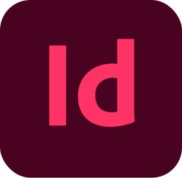</a>&nbsp;
<a href="https://www.adobe.com/creativecloud.html" title="Adobe Creative Cloud"></a>&nbsp;
<a href="https://www.adobe.com/products/firefly.html" title="Adobe Firefly">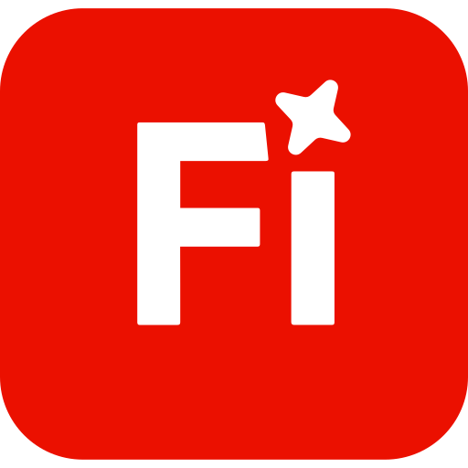</a>&nbsp;
<a href="https://www.canva.com/" title="Canva"></a>&nbsp;
<a href="https://www.blackmagicdesign.com/products/davinciresolve" title="DaVinci Resolve"></a>&nbsp;
<a href="https://www.apple.com/final-cut-pro/" title="Final Cut Pro"><picture><source media="(prefers-color-scheme: dark)" srcset="./assets/stack/final-cut-pro.svg"></picture></a>

### Enterprise analytics & data suite

<a href="https://www.microsoft.com/power-platform/products/power-bi/" title="Microsoft Power BI"></a>&nbsp;
<a href="https://www.tableau.com/" title="Tableau"></a>&nbsp;
<a href="https://www.microsoft.com/microsoft-365/excel" title="Microsoft Excel">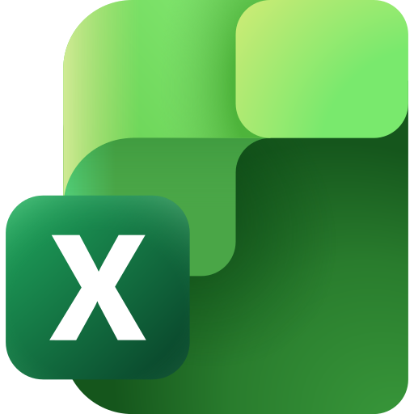</a>&nbsp;
<a href="https://workspace.google.com/products/sheets/" title="Google Sheets"></a>&nbsp;
<a href="https://www.microsoft.com/microsoft-365" title="Microsoft 365">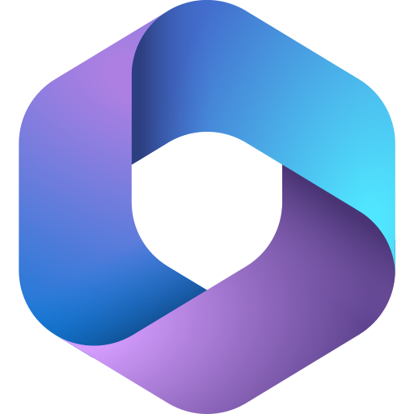</a>

</div>

<br />

### Extended capability map

| Domain | Capabilities |
|:--|:--|
| **AI & agents** | RAG · embeddings · vector search · tool orchestration · agent memory · multi-agent workflows · human approval · evaluations · guardrails · multimodal AI |
| **Applications** | React · Next.js · Node.js · FastAPI · Django · Flask · NestJS · Spring · .NET · REST · GraphQL · event-driven services |
| **Infrastructure** | Linux · Docker · Kubernetes · AWS · Azure · Google Cloud · Terraform · Ansible · CI/CD · distributed systems · observability · reliability engineering |
| **Data** | PostgreSQL · Redis · MongoDB · pandas · Apache Spark · Power BI · Tableau · Excel · Google Sheets |
| **Production** | Figma · Adobe Creative Cloud · Canva · DaVinci Resolve · Final Cut Pro · Remotion · Sora · Higgsfield · ComfyUI · FFmpeg |
| **Systems** | AI agents · SaaS platforms · automation engines · CRM systems · dashboards · client portals · APIs · outreach systems · production websites |

<br />

## 04 — How I work

```text
BUSINESS OUTCOME
      ↓
SMALLEST COMPLETE SYSTEM
      ↓
SHIP TO A REAL ENVIRONMENT
      ↓
VERIFY WITH EVIDENCE
      ↓
SCALE WHAT WORKS
```

<table>
<tr>
<td align="center" width="25%"><strong>01</strong><br /><sub>DEFINE</sub><br /><br />Clarify the commercial outcome, constraints, users, and proof of success.</td>
<td align="center" width="25%"><strong>02</strong><br /><sub>ARCHITECT</sub><br /><br />Choose the smallest durable system that can produce the outcome.</td>
<td align="center" width="25%"><strong>03</strong><br /><sub>SHIP</sub><br /><br />Build end to end, integrate the real services, and deploy.</td>
<td align="center" width="25%"><strong>04</strong><br /><sub>VERIFY</sub><br /><br />Test behavior, reliability, economics, and operational readiness.</td>
</tr>
</table>

> The objective is not to add more software. It is to build a better operating system for the business.

<br />

## 05 — Venture portfolio

<div align="center">


<br />

<table>
<tr>
<td width="33%" align="center"><a href="https://glosssociete.com/">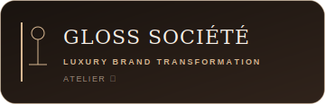</a></td>
<td width="33%" align="center"><a href="https://www.businessprofileboost.com/"></a></td>
<td width="33%" align="center"><a href="https://www.neuralmodestudio.com/">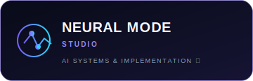</a></td>
</tr>
<tr>
<td width="33%" align="center"><a href="https://swisspropertystudio.com/">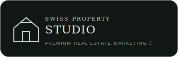</a></td>
<td width="33%" align="center"><a href="https://revhauscreative.com/">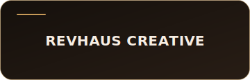</a></td>
<td width="33%" align="center"><a href="https://autodiscounts.nl/">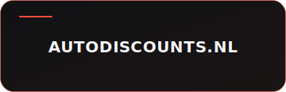</a></td>
</tr>
<tr>
<td width="33%" align="center"><a href="https://ribbsaeteradvertising.com/"></a></td>
<td width="33%" align="center"><a href="https://ribbsaetersports.com/"></a></td>
<td width="33%" align="center"><a href="https://etherealcasting.com/en">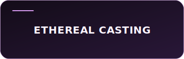</a></td>
</tr>
</table>

</div>

<br />

## 06 — Commercial engagements

I work best on serious builds with a defined business problem, a real budget, access to decision-makers, and a direct path to execution.

<div align="center">

`AI PRODUCT ARCHITECTURE` &nbsp; `FOUNDING ENGINEERING` &nbsp; `AUTOMATION SYSTEMS`<br />
`TECHNICAL DUE DILIGENCE` &nbsp; `PRODUCTION AI` &nbsp; `PLATFORM DELIVERY`

<br /><br />

### Have an ambitious system to build?

<a href="https://www.ribbsaetersystems.com/">
  
</a>
&nbsp;&nbsp;
<a href="https://www.linkedin.com/in/patrickribbsaeter/">
  
</a>

<br /><br />


</div>
