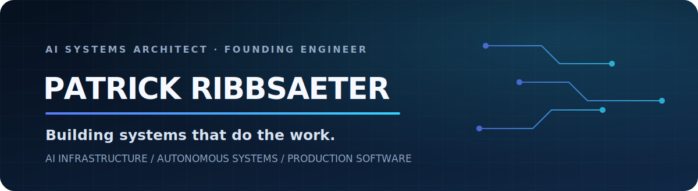

<p align="center">
  <a href="https://github.com/patrickswedish" aria-label="Patrick Ribbsaeter on GitHub">
    
  </a>
</p>

<br />

<p align="center">
  <a href="https://www.linkedin.com/in/patrickribbsaeter/" aria-label="Connect with Patrick Ribbsaeter on LinkedIn"></a>&nbsp;&nbsp;&nbsp;
  <a href="https://ribbsaetersystems.com" aria-label="Visit Ribbsaeter Systems"></a>
</p>

<p align="center">
  <code>⌖&nbsp; BASED IN · SWITZERLAND</code>
</p>

<br />

I'm **Patrick Ribbsaeter**, an **AI systems architect and founding engineer** building enterprise AI systems, autonomous-agent infrastructure, automation engines, and production software from the interface to the infrastructure. My focus is high-leverage engineering: turning expensive operational problems into secure, reliable systems that can be measured, maintained, and scaled.

<br />

## High-value engineering focus

| Capability | What I build |
|---|---|
| **Enterprise AI systems** | Agent platforms, retrieval systems, evaluations, guardrails, model routing, and human-in-the-loop control |
| **Forward-deployed engineering** | Production solutions shaped around real users, workflows, constraints, and business outcomes |
| **AI infrastructure & MLOps** | Model serving, observability, data pipelines, deployment systems, reliability, and cost control |
| **Platform engineering** | Internal developer platforms, APIs, cloud architecture, CI/CD, infrastructure as code, and secure operations |
| **Intelligent automation** | Multi-step workflow engines, tool orchestration, document pipelines, integrations, and exception handling |
| **Full-stack AI products** | High-quality product interfaces backed by dependable AI, data, and distributed-system foundations |
| **Design engineering & visual direction** | Luxury-caliber visual systems, editorial composition, interaction, motion, and polished product experiences built with production rigor |

<br />

## Large language models and AI ecosystems

I work across proprietary and open-model ecosystems, provider APIs, model hubs, and accelerated inference platforms—selecting models by capability, reliability, latency, privacy, and operating cost rather than brand loyalty.

<p align="center">
  <a href="https://chatgpt.com/" aria-label="Open ChatGPT"></a>&nbsp;
  <a href="https://claude.com/product/overview" aria-label="Visit Claude by Anthropic"></a>&nbsp;
  <a href="https://gemini.google.com/" aria-label="Open Google Gemini"></a>&nbsp;
  <a href="https://huggingface.co/meta-llama" aria-label="Visit the official Meta Llama model organization"></a>&nbsp;
  <a href="https://huggingface.co/" aria-label="Visit Hugging Face"></a>&nbsp;
  <a href="https://mistral.ai/" aria-label="Visit Mistral AI"></a>&nbsp;
  <a href="https://www.deepseek.com/" aria-label="Visit DeepSeek"></a>&nbsp;
  <a href="https://www.kimi.com/" aria-label="Open Kimi by Moonshot AI"></a>&nbsp;
  <a href="https://qwen.ai/" aria-label="Visit Alibaba Qwen"></a>&nbsp;
  <a href="https://x.ai/grok" aria-label="Visit Grok by xAI"></a>&nbsp;
  <a href="https://cohere.com/" aria-label="Visit Cohere"></a>&nbsp;
  <a href="https://www.01.ai/" aria-label="Visit 01.AI and Yi"></a>&nbsp;
  <a href="https://chat.z.ai/" aria-label="Open Z.ai and GLM"></a>&nbsp;
  <a href="https://www.ai21.com/" aria-label="Visit AI21 Labs"></a>&nbsp;
  <a href="https://www.minimax.io/" aria-label="Visit MiniMax"></a>&nbsp;
  <a href="https://azure.microsoft.com/en-us/products/ai-foundry/" aria-label="Visit Microsoft Azure AI Foundry"></a>&nbsp;
  <a href="https://aws.amazon.com/bedrock/" aria-label="Visit Amazon Bedrock"></a>&nbsp;
  <a href="https://www.nvidia.com/en-us/ai/" aria-label="Visit NVIDIA AI"></a>&nbsp;
  <a href="https://groq.com/" aria-label="Visit Groq"></a>&nbsp;
  <a href="https://www.cerebras.ai/" aria-label="Visit Cerebras"></a>
</p>

<p align="center"><sub>Provider marks sourced from <a href="https://github.com/lobehub/lobe-icons">Lobe Icons</a> under the MIT License. All trademarks remain the property of their respective owners.</sub></p>

**Model territory:** OpenAI / ChatGPT · Anthropic / Claude · Google Gemini · Meta Llama · Hugging Face · Mistral AI · DeepSeek · Moonshot AI / Kimi · Alibaba Qwen · xAI / Grok · Cohere · 01.AI / Yi · Z.ai / GLM · AI21 Labs · MiniMax · Azure AI · AWS Bedrock · NVIDIA AI · Groq · Cerebras

<br />

## Polyglot engineering

The stack follows the problem. **AI expands delivery breadth; builds, tests, reviews, and target-system conventions establish correctness.**

### Languages, frameworks, and systems

<p align="center">
  <a href="https://github.com/tandpfun/skill-icons" aria-label="Skill Icons source repository"></a>
</p>
<p align="center">
  <a href="https://github.com/tandpfun/skill-icons" aria-label="Skill Icons source repository"></a>
</p>

**Language domains:** Python · TypeScript · JavaScript · Go · Rust · C · C++ · C# · Java · Kotlin · Swift · PHP · Ruby · Scala · Elixir · Clojure · Haskell · Dart · Lua · Perl · R · MATLAB · Solidity · SQL · Bash · PowerShell

### Frameworks, AI, data, and infrastructure

<p align="center">
  <a href="https://github.com/tandpfun/skill-icons" aria-label="Skill Icons source repository"></a>
</p>

<p align="center"><sub>Technology marks rendered with <a href="https://github.com/tandpfun/skill-icons">Skill Icons</a> under the MIT License.</sub></p>

| Area | Technology territory |
|---|---|
| **AI & data** | PyTorch, TensorFlow, Hugging Face, LLM APIs, RAG, evaluation systems, pandas, Spark, PostgreSQL, Redis, vector search |
| **Applications & APIs** | React, Next.js, Node.js, FastAPI, Django, Flask, NestJS, Spring Boot, .NET, REST, GraphQL, event-driven services |
| **Cloud & platform** | Linux, Docker, Kubernetes, AWS, Azure, GCP, Terraform, Ansible, GitHub Actions, observability, security controls |
| **Architecture** | Distributed systems, asynchronous workflows, multi-agent orchestration, integration architecture, reliability engineering |

<br />

## How I work

```text
Business outcome → narrow production slice → instrument and verify → scale from evidence
```

- **Outcome-first:** technology is selected for business impact, not novelty.
- **Production-minded:** security, failure modes, observability, and operating cost are part of the design.
- **Full-stack ownership:** product, model, data, backend, infrastructure, and delivery are one system.
- **Evidence over claims:** working software, tests, benchmarks, reviews, and releases establish credibility.

<br />

## Current direction

Building original, production-grade AI and automation projects while contributing focused improvements to established open-source systems.

<p align="center"><strong>Design the system. Ship the smallest complete version. Verify it. Improve from evidence.</strong></p>

<!-- GitHub profile README -->
