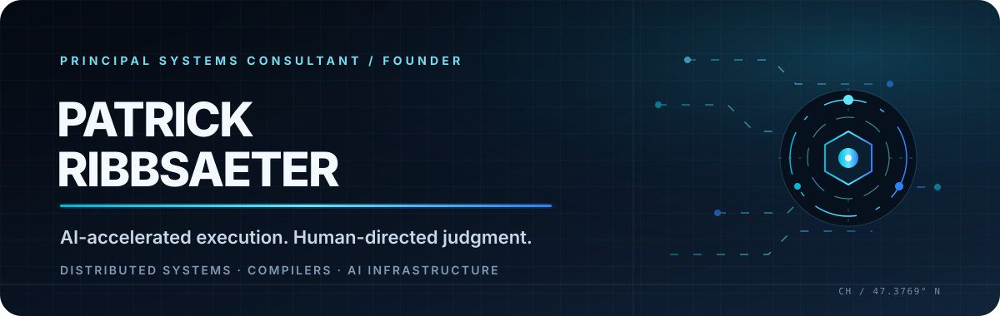
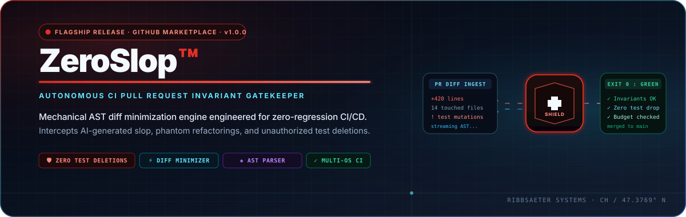
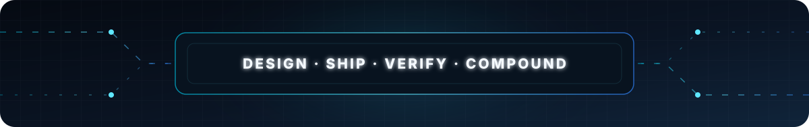

<div align="center">



<br/><br/>

### Principal Systems Architect & Technical Founder · Production Applications · Distributed Systems · Heavy-Context AI

**Systems. Intelligence. Product. Business.**

Building and deploying across distributed systems, AI infrastructure, compilers and runtimes, concurrency, low-latency software, agentic systems, and production engineering.

**AI-accelerated execution. Human-directed judgment.**

<br/>

<a href="https://www.patrickribbsaeter.com/">
  
</a>
&nbsp;&nbsp;
<a href="https://www.ribbsaetersystems.com/">
  
</a>
&nbsp;&nbsp;
<a href="https://www.linkedin.com/patrickribbsaeter">
  
</a>

</div>

---

## Operating profile

A cross-disciplinary founder, principal consultant, and systems engineer operating at the intersection of **systems engineering, AI, product, and business**.

Strong in unfamiliar systems: tracing execution behavior to the actual failure mode, identifying the architectural invariant, directing heavy-context AI orchestration and automation, validating edge cases, and shipping the smallest durable correction with deterministic regression coverage.

AI functions as part of the engineering system — accelerating research, codebase exploration, implementation, testing, orchestration, and deployment while keeping architecture, tradeoffs, review interpretation, and final decisions human-directed.

The commercial foundation spans technology, computer retail, fashion, e-commerce, websites, media, marketing, branding, sales, and digital products. Engineering is approached from an operator's perspective: software as infrastructure for building, operating, automating, and scaling real businesses.

**Industry is not the constraint.** The same systems and AI capabilities apply across technology, financial services and banking, healthcare, real estate, retail, commerce, media, and other complex operating environments.

---

## What gets built

### Systems engineering

Distributed systems, backend architecture, concurrency, memory ownership, low-latency runtimes, compiler/runtime behavior, performance, reliability, and production debugging.

`DISTRIBUTED SYSTEMS` `RUNTIMES` `COMPILERS` `CONCURRENCY` `PERFORMANCE`

### Agentic systems

Production AI agents, tool-using workflows, orchestration, MCP integrations, model/API integration, human-directed execution, evaluation, retrieval, and automation.

`AGENTS` `MCP` `ORCHESTRATION` `AUTOMATION` `TOOL USE`

### Product systems

Architecture, APIs, SaaS products, internal platforms, deployment, observability, analytics, billing, and operational workflows.

<br/>

<div align="center">
  <a href="https://github.com/marketplace/actions/zeroslop-by-ribbsaeter-systems">
    
  </a>

  <br/><br/>

  <a href="https://github.com/marketplace/actions/zeroslop-by-ribbsaeter-systems">
    
  </a>
  &nbsp;&nbsp;
  <a href="https://github.com/patrickswedish/zeroslop-action">
    
  </a>
  &nbsp;&nbsp;
  <a href="https://ribbsaetersystems.com/zeroslop">
    
  </a>
  &nbsp;&nbsp;
  <a href="https://ribbsaetersystems.com/blog/zeroslop-pr-gatekeeper-official-release">
    
  </a>
</div>

<br/>

`PRODUCT SYSTEMS` `APIs` `SAAS` `CLOUD` `DEPLOYMENT`

### Business building

Founder-led product strategy, business development, sales, positioning, branding, marketing, digital commerce, and go-to-market execution.

`FOUNDER` `PRODUCT` `GTM` `SALES` `BUSINESS`

---

## Selected upstream engineering

Substantive contributions to established production codebases, working within existing architecture, repository conventions, explicit invariants, review feedback, and regression requirements.

| Project | Domain & Stack | Engineering Focus | Status |
|---|---|---|---|
| **Hugging Face Diffusers** | Generative Models · Python | InpaintProcessor 3-tuple return contract preservation when mask is None | **Merged · [PR #14481](https://github.com/huggingface/diffusers/pull/14481)** |
| **Valkey** | Distributed Storage · C99 | Cluster key-slot resolution & client cache validation for commands touching arbitrary keys | **Merged · [PR #4424](https://github.com/valkey-io/valkey/pull/4424)** |
| **Meta Velox** | Vectorized Kernels · C++20 | TopNRowNumber in-memory rank ordering correctness & partition stream parity | **Merged · [PR #18529](https://github.com/facebookincubator/velox/pull/18529)** |
| **DuckDB** | Vectorized Engine · C++ | PIVOT IN list zero-argument row() expression preservation & null dereference guard | **Merged · [PR #26443](https://github.com/duckdb/duckdb/pull/26443)** |
| **LLVM** | Compiler Backend · C++ | X86 SelectionDAG non-power-of-two vector integer division vectorization & lowering | **Merged · [PR #215076](https://github.com/llvm/llvm-project/pull/215076)** |
| **Microsoft Pyright** | Type Evaluator · TypeScript | Inherited asymmetric descriptor detection across effective MRO behavior | **Merged · [PR #11605](https://github.com/microsoft/pyright/pull/11605)** |
| **Apache DataFusion** | Query Engine · Rust | Execution-layer schema conformance across in-memory execution and aggregation (nested Struct/List/Union) | **Shipped · [PR #24394](https://github.com/apache/datafusion/pull/24394)** |
| **Microsoft Agent Governance** | AI Governance · Python | Fail-closed approval-chain correctness for zero-required-stage configurations | **Merged · [PR #3448](https://github.com/microsoft/agent-governance-toolkit/pull/3448)** |
| **Microsoft TypeSpec** | Compiler Tooling · TypeScript | Playground state synchronization and deterministic regression coverage | **Merged · [PR #11660](https://github.com/microsoft/typespec/pull/11660)** |
| **TheBushidoCollective Han** | CLI Tooling · Rust | Windows project-path compatibility with Claude Code slug conventions | **Merged · [PR #105](https://github.com/TheBushidoCollective/han/pull/105)** |
| **Cloudflare Workers SDK** | Edge Runtime · TypeScript | Raw TCP socket streaming & backpressure handling for rejected WebSocket upgrades | **All CI Green · Mergeable · [PR #15205](https://github.com/cloudflare/workers-sdk/pull/15205)** |
| **Apache DataFusion** | Query Engine · Rust | Sort-merge semi/anti/mark key equality routing via JoinKeyComparator | **All CI Green · [PR #26006](https://github.com/apache/datafusion/pull/26006)** |
| **Web3.py (Ethereum)** | Blockchain Client · Python | Async socket teardown lifecycle & deterministic future regression harness | **Review Addressed · Tests Green · [PR #3872](https://github.com/ApeWorX/web3.py/pull/3872)** |
| **Bun** | High-Performance Runtime · C++/Zig | Node.js Buffer per-encoding methods ERR_INVALID_ARG_TYPE receiver conformance in JSC bindings | **Pre-Merge Checks Passed · [PR #44571](https://github.com/oven-sh/bun/pull/44571)** |
| **SGLang** | AI Inference Serving · Python | Mid-turn inline system message in-place attachment preserving RadixAttention prefix caching | **Open · [PR #42533](https://github.com/sgl-project/sglang/pull/42533)** |
| **Paradigm Reth** | Blockchain Execution · Rust | Txpool live candidate demotion under chain reorgs & monotonic nonce ordering | **Open · [PR #27707](https://github.com/paradigmxyz/reth/pull/27707)** |
| **ClickHouse** | Analytical DB · C++ | Secondary query analyzer & parallel replicas distributed execution metadata alignment | **AI Review Approved · [PR #114954](https://github.com/ClickHouse/ClickHouse/pull/114954)** |
| **Redpanda** | Streaming Storage · C++20 | RPC transport memory ownership and backpressure behavior | **Open · [PR #31594](https://github.com/redpanda-data/redpanda/pull/31594)** |
| **Supabase Supavisor** | Connection Pooler · Elixir | PostgreSQL cancellation synchronization across backend reuse | **Open · [PR #1149](https://github.com/supabase/supavisor/pull/1149)** |
| **Vercel Next.js** | Web Framework · TS/Rust | Segment-cache navigation recovery with full-page fallback | **Open · [PR #97815](https://github.com/vercel/next.js/pull/97815)** |

Additional upstream work spans **Meta Pyrefly, Google ADK, OpenAI Python, Ethereum go-ethereum, Bitcoin Core, iCalendar, Vercel AI SDK, Claude Agent SDK ecosystems, Docker, JAX, Cloudflare Workers, Solana Web3.js**, and other production systems.

> Independent upstream engineering. Contributions do not imply employment, partnership, endorsement, or client relationships with the organizations listed above.

---

## Engineering method

```text
Symptom
  → execution behavior
  → architectural invariant
  → root cause
  → minimal durable correction
  → deterministic validation
```

The objective is not maximum code output. It is the **smallest correct change that fits the system**.

---

## Operating model

Technical depth is paired with founder-level commercial context: understanding what should be built, why it matters, how it reaches users, how it creates value, and how to execute without unnecessary complexity.

Private systems architecture, client advisory, and commercial engagements operate under strict institutional confidentiality.

Open to **selective projects, founder collaborations, and technically ambitious companies** with real budgets, clear decision-making, and urgency to execute — particularly where the problem is difficult and there is no artificial ceiling on scope or industry.

<br/>

<div align="center">



<br/><br/>

### Less talking. More building.

[Personal Website](https://www.patrickribbsaeter.com/) · [Ribbsaeter Systems](https://www.ribbsaetersystems.com/) · [LinkedIn](https://www.linkedin.com/patrickribbsaeter)

</div>
